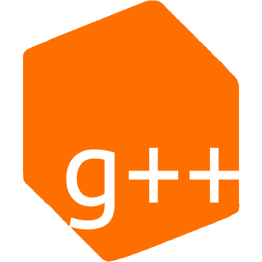

[](https://discord.gg/TFJqhsC)




# Glowstone

A fast, customizable and compatible open source server for Minecraft: Java Edition.

## Introduction

Glowstone is a lightweight, from scratch, open source
[Minecraft](https://minecraft.net) server written in Java that supports plugins
written for the Bukkit API and its major forks, Spigot and Paper.

The main goals of the project are to provide a lightweight implementation
of the Bukkit API and Minecraft server where exact vanilla functionality is
not needed or higher performance is desired than the official software can
deliver. Glowstone makes use of a thread-per-world model and performs
synchronization only when necessitated by the Bukkit API.

Still have questions? Check out our [FAQ](https://docs.glowstone.net/en/latest/FAQ/frequently_asked_features.html).

## Features

Glowstone has a few key advantages over CraftBukkit:
 * It is **100% open source**. While CraftBukkit and most other mods are open
   source, they rely on decompiled Minecraft source code. Glowstone's code is
   completely original.
 * Because of this, it is easy to contribute to Glowstone's development. The
   barrier of entry to contributions is lower because there is no need to work
   around decompiled source or maintain a minimal diff.
 * Glowstone supports all plugins written for the Bukkit, Spigot and Paper APIs natively. In
   practice, some plugins may try to make use of parts of the API which are not
   yet implemented, but in a completed state Glowstone would support all Bukkit plugins.
 * Glowstone's simplicity affords it a performance improvement over CraftBukkit
   and other servers, making it especially suited for situations where a large
   amount of players must be supported but vanilla game features are not needed.
 
However, there are several drawbacks:
 * Glowstone **is not finished**. Nothing is guaranteed to work, though many things
   are likely to. If in doubt, file an issue.
 * Bukkit plugins which expect the presence of CraftBukkit-specific code
   (that are in the `org.bukkit.craftbukkit` or `net.minecraft.server` packages)
   will not work on Glowstone unless they are designed to fail gracefully.
 * Glowstone is not produced by the Bukkit team, and while we do make an effort
   to produce quality work, Glowstone does not undergo the same rigorous testing
   as the Bukkit project.
   
For a current list of features, [check the wiki](https://github.com/GlowstoneMC/Glowstone/wiki/Current-Features).

## Downloads

The latest LTS and monthly releases, as well as a direct link to our latest build can be found on [our website](https://glowstone.net/#downloads).

Older releases can be found on [GitHub](https://github.com/GlowstoneMC/Glowstone/releases).

## Building

### 1. Setup
After installing [Oracle JDK](https://oracle.com/technetwork/java/javase/downloads) (recommended) or [OpenJDK](https://openjdk.java.net/), and
[Maven](https://maven.apache.org), checkout the source:

```sh
git clone https://github.com/GlowstoneMC/Glowstone
cd Glowstone
```

### 2. Build

```sh
./scripts/build.sh
```

The final jar will be placed in `target/` named `glowstone.jar`.

## Running

Running Glowstone is simple because its dependencies are shaded into the output
jar at compile time. Simply execute `java -jar glowstone.jar` along with any
extra JVM options desired (we recommend using `java -Xms1G -Xmx1G -XX:+UseG1GC -jar glowstone.jar`). A variety of command-line options are also available -
run `java -jar glowstone.jar --help` for more information.

By default, configuration is stored in the `config/` subdirectory and logs
are stored in the `logs/` subdirectory. The main configuration file is
`config/glowstone.yml`, which replaces CraftBukkit's `server.properties` and
`bukkit.yml`. Settings from these two files will be copied over to Glowstone's
configuration during the default configuration generation process.

Glowstone uses [JLine](https://jline.github.io/jline2/) for console input and colored
console output. The JLine console can be disabled in the configuration if a
flat console is desired.

Need more help? Check out [our wiki](https://github.com/GlowstoneMC/Glowstone/wiki#using-glowstone) for some guides that will help you with running,
maintaining and configuring your Glowstone server.

## Playing

For those of you who just want to play on a Glowstone server, we have one available 
for testing at `mc.glowstone.net`. Have fun!

## Docs and Support

The best place to receive support is on [GitHub issues](https://github.com/GlowstoneMC/Glowstone/issues).
When reporting bugs, please retest and include whether the problem reproduces on:

* Earlier [builds](https://circleci.com/gh/GlowstoneMC/Glowstone) of Glowstone

Javadocs for Glowstone can be found [here](https://glowstone.net/jd/glowstone/).

For documentation on the Glowkit API (an updated Bukkit for Glowstone, based on the Paper API, compatible with Spigot's update to Bukkit), see the [Glowkit Javadocs](https://glowstone.net/jd/glowkit/).

## Contributing

First of all, thank you for your interest in advancing Glowstone! We always love to see new developers work on the project! You can find all of our resources on how to get started on our [wiki](https://github.com/GlowstoneMC/Glowstone/wiki#contributing).

## Sponsors

* **[Aternos](https://aternos.org/) - Minecraft Servers. Free. Forever.**
* [Martin Panzer (Postremus)](https://martinpanzer.de/)

[More backers](https://github.com/GlowstoneMC/Glowstone/blob/dev/docs/BACKERS.md)

Sponsor Glowstone [on Bountysource](https://www.bountysource.com/teams/glowstonemc)!

## Credits

 * [The Minecraft Coalition](https://wiki.vg/) and [`#mcdevs`](https://github.com/mcdevs) -
   protocol and file formats research.
 * [The Bukkit team](https://bukkit.org) for their outstandingly well-designed
   plugin API.
 * [The SpigotMC team](https://spigotmc.org/) for updating and enhancing
   the Bukkit plugin API.
 * [AquiferMC](https://aquifermc.org/) for further enhancing the Bukkit API.
 * [The SpongePowered Team](https://www.spongepowered.org/) for
   creating the Sponge API.
 * [Trustin Lee](https://github.com/trustin) - author of the
   [Netty](https://netty.io/) library.
 * [Graham Edgecombe](https://github.com/grahamedgecombe/) - author of the
   original [Lightstone](https://github.com/grahamedgecombe/lightstone).
 * [Tad Hardesty](https://github.com/SpaceManiac) and [all the contributors](https://github.com/GlowstoneMC/Glowstone-Legacy/graphs/contributors) to Glowstone Legacy.
 * [deathcap](https://github.com/deathcap) for starting Glowstone++.
 * All the people behind [Maven](https://maven.apache.org/team-list.html) and [Java](https://java.net/people).
 * [Notch](https://notch.tumblr.com/) and
   [Mojang](https://mojang.com/about) - for making such an awesome game in the first
   place!

## Copyright

Glowstone is open-source software released under the MIT license. Please see
the `LICENSE` file for details.

Glowkit is open-source software released under the GPL license. Please see
the `LICENSE.txt` file in the Glowkit repository for details.
